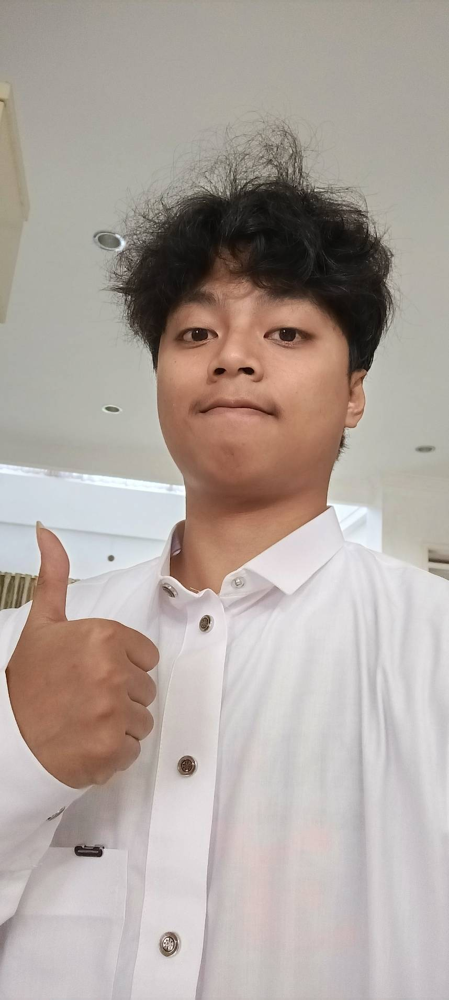

# UTS 1 - All About Me

### Profil Singkat
* **Nama Lengkap:** Rifki Fariz Farabi
* **NIM:** 11422030
* **Tempat, Tanggal Lahir:** Bogor, 13 Maret 2004
* **Program Studi:** Rekayasa Pertanian

### Latar Belakang dan Perjalanan Akademik
Perkenalkan, nama saya Rifki Fariz Farabi. Saat ini, saya sedang menempuh perjalanan akademik sebagai mahasiswa di jurusan Rekayasa Pertanian. Jika menoleh ke belakang, alasan awal saya memilih jurusan ini mungkin terdengar cukup sederhana, yaitu keinginan untuk menghindari bidang studi yang didominasi oleh hitungan rumit seperti fisika dan kimia. Namun, seiring berjalannya waktu, pandangan saya berubah sepenuhnya. Di jurusan ini, saya justru mendapatkan wawasan mendalam mengenai bagaimana ilmu pengetahuan dan teknologi dapat diimplementasikan sebagai solusi nyata bagi berbagai permasalahan di masyarakat, khususnya di sektor pangan dan lingkungan. Saya sangat percaya bahwa setiap individu memiliki peran dan takdirnya masing-masing, dan bagi saya, masa kuliah bukan sekadar tempat belajar teori, melainkan ruang untuk bertumbuh dan memahami peran strategis saya di dunia luar nantinya.

### Minat, Keahlian, dan Kreativitas
Dalam menjalani keseharian, saya adalah pribadi yang sangat senang mengeksplorasi hal-hal baru yang dapat memperluas wawasan sekaligus mengasah sisi kreativitas. Saya memiliki ketertarikan yang sangat besar pada bidang inovasi teknologi pertanian, strategi bisnis, hingga dinamika pasar uang. Menurut pandangan saya, perpaduan antara ilmu produksi pertanian dengan literasi finansial yang kuat akan menjadi modal yang sangat berharga di masa depan. Di luar urusan akademik, saya mengisi waktu luang dengan membaca, menulis, serta berolahraga. Selain itu, saya memiliki hobi di bidang fotografi. Saya sangat menikmati proses menangkap momen-momen langka dan mengabadikannya ke dalam bentuk gambar yang memiliki cerita tersendiri.

### Analisis Karakter dan Kepribadian
Sebagai seorang individu, saya menyadari bahwa saya bukanlah pribadi yang sempurna, namun saya terus berusaha untuk mengenali potensi diri melalui refleksi yang jujur. Salah satu kelebihan utama saya adalah kemampuan untuk tetap bersikap tenang meski berada dalam situasi yang sulit, serta selalu berusaha untuk berpikir secara rasional sebelum mengambil sebuah keputusan penting. Saya juga merasa memiliki ketekunan dan rasa ingin tahu yang sangat tinggi, sehingga saya selalu antusias untuk mempelajari hal-hal baru dan mencari solusi dari berbagai sudut pandang yang berbeda.

Di sisi lain, saya juga memiliki beberapa kekurangan yang terus saya coba perbaiki, seperti kecenderungan untuk terlalu fokus pada detail kecil sehingga terkadang menghambat kecepatan saya dalam menyelesaikan tugas secara efisien. Selain itu, saya menyadari bahwa saya cenderung menjadi pribadi yang pendiam ketika berada di lingkungan yang baru, meskipun pada akhirnya saya selalu mampu beradaptasi dengan baik seiring berjalannya waktu. Saya sangat percaya bahwa dengan berani mengakui kelebihan dan kekurangan diri, itu adalah langkah awal yang paling penting untuk terus bertransformasi menjadi pribadi yang lebih berkualitas.

---
[⬅ Kembali ke Halaman Utama](./index.md)
